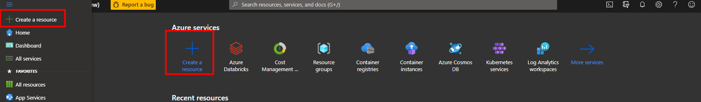

# Create an Azure Data Science Virtual Machine

The Data Science Virtual Machine (DSVM) is a virtual machine that runs on the Azure cloud platform.
In this module we will walk through how to create it.

## How the Data Science Virtual Machine works

After you've specified an operating system and hardware platform for your DSVM, Azure creates the virtual machine and related resources. The related resources include such things as a storage account and a network security group.

When you start the virtual machine, Azure restores the image to the specified hardware type and starts the operating system. You can then connect, as you'll learn how to do in this module. After you're connected, you use the virtual machine in the same way you'd use any other machine. After you're done, you shut down the machine by using either the operating system facilities or the Azure portal.

Your charges are based on the type of hardware (compute power, RAM, and storage) that you specified. You're charged only for time that the virtual machine is running, at a half-minute granularity.

## When to use the Data Science Virtual Machine

The goal of the Data Science Virtual Machine is a friction-free, preconfigured environment for data science and machine learning. The experience is familiar and usable by data professionals of all skill levels.

Instead of rolling out a comparable workspace on your own, you can provision a Data Science Virtual Machine. That choice can save you days or even weeks on the processes of installation, configuration, and package management. After your Data Science Virtual Machine is allocated, you can immediately begin working on your data science project.

## Sample use cases

The Data Science Virtual Machine is a good fit in several use cases like:

* Moving data science workloads to the cloud

* Data science training and education

* On-demand elastic capacity for large-scale projects like Data science hakathons or large-scale data modeling and exploration that requires scaled-out hardware capacity, typically for short duration.

* Short-term experimentation and evaluation with samples and walkthroughs preinstalled.

* Deep learning with GPUs

## Creating an Azure Data Science Virtual Machine

1. Sign in to the Azure portal by using the account that you have created.

2. Select the Create a resource option in the upper-left corner of the portal page like in the figure bellow. The Azure Marketplace pane opens.

As you can see, there are many selectable options. We want to create a Data Science Virtual Machine running on Ubuntu.

3. Use the Search the Marketplace search bar to find "Data Science." In the list, select the Data Science Virtual Machine - Ubuntu 18.04 option.

Screenshot that shows a search box with Data Science Virtual Machine Ubuntu Server 18.04 highlighted.

4. The pane that opens is the Create a virtual machine page. Notice the wizard-based approach that we can use to configure the VM.

### Configure the VM

1. We need to configure the basic parameters of our Ubuntu virtual machine.

* Use the following values on the Basics tab:

  * Set Subscription to the one you created.

  * Create a Resource Group with name RG-DSVM

  * Enter Virtual machine name as ubuntu-dsvm.

  * The Region value should be the same as that of the resource group.

  * For Availability options, choose No infrastructure redundancy required.

  * The Image value should be the Data Science Virtual Machine - Ubuntu 18.04 option that you selected from Azure Marketplace.

  * The Size value of the VM should be Standard_DS1_v2. If that's not the selected value:

    * Select Choose size.
    * Enter DS1_ in the search box.
    * Choose the DS1_v2 row.
    * Click Select to choose that size and return to the configuration screen.
    
  * Change Authentication Type to Password.

  * Choose and record a username for Username and a strong password for Password.
  
  

  
  
2. You can explore several other tabs to see the settings that you can influence during the VM creation. On the Disks tab, for example, you can specify your data disks. After you're finished exploring, select Review + create to review and validate the settings.

3. On the review screen, verify that all the settings are the way you want them. Then select Create.

4. You can monitor the deployment through the Notifications panel. Select the icon on the top toolbar to show or hide the panel.

5. The VM deployment process takes a few minutes to finish. A notification will inform you that the deployment succeeded. Select the Go to resource button to go to the VM overview page.

6. You can see all the information and configuration options for your newly created Data Science Virtual Machine. One of the pieces of information is the Public IP address value. Make note of this IP address, because you'll need it to connect.

Congratulations! With a few steps, you deployed a Data Science Virtual Machine running on Linux. Now let's connect to it.

Next hands on Lab:
[Access the jupyter notebook](https://github.com/joaosalvadoMicrosoft/Tutorial_Create_DSVM/blob/master/3.%20Access%20the%20jupyter%20notebook/README.md)

