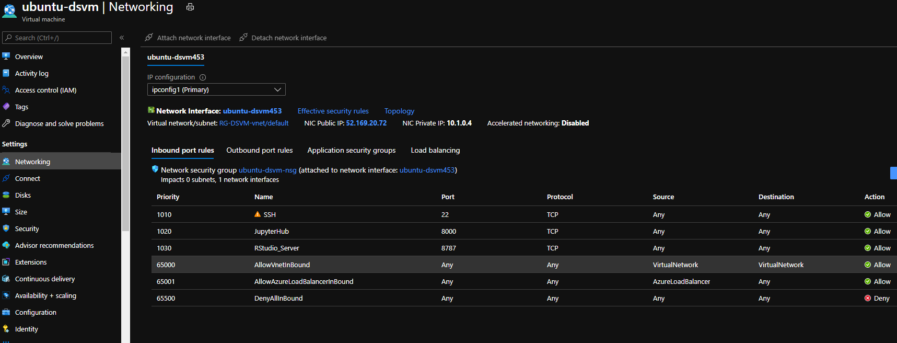
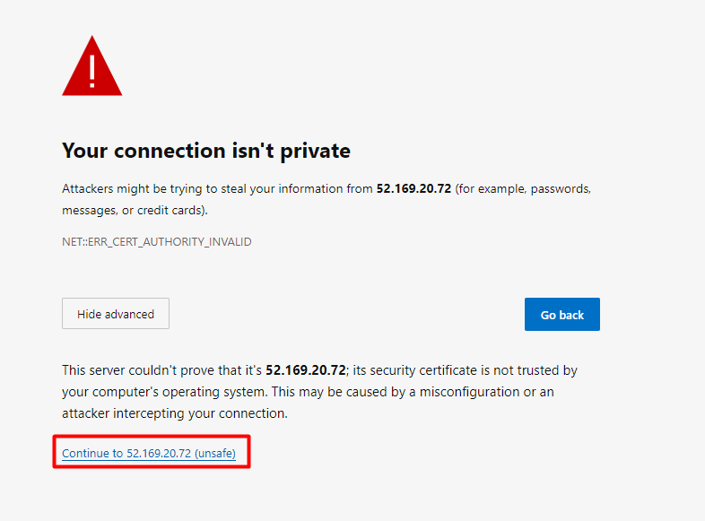
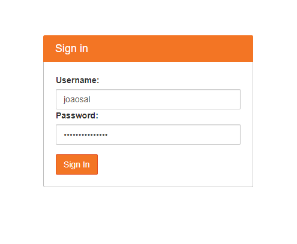
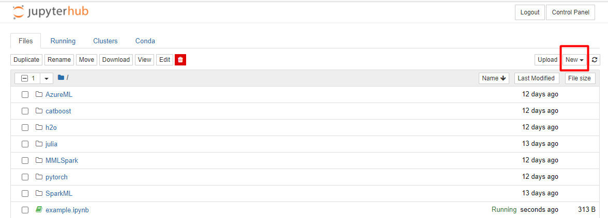

# Access the jupyter notebook

After having created the virtual machine on Azure you should be able to access the jupyter notebook on your browser as the network ports for the jupyter should be already open, to confirm this please go to the networking pane and confirm that looks like this with port 8000 allowed:

For the simplicity of this demo we will use the jupyter notebook direcly in the browser. 

To access the jupyter notebook, on your browser search https://YOUR_MACHINE_IP:8000 where YOUR_MACHINE_IP should be the IP that you retrieve from the Azure portal like bellow:

 
If you see an image like bellow, click on advance and continue to the IP.

After that you should see a login page and you should insert there your username and password that you used when created the Virtual Machine:

After log in you should see something similar with the image bellow, by clicking on new you can create a notebook with the kernel of your choice.
There are already some examples pre installed as you can see, you can explore them from here.

